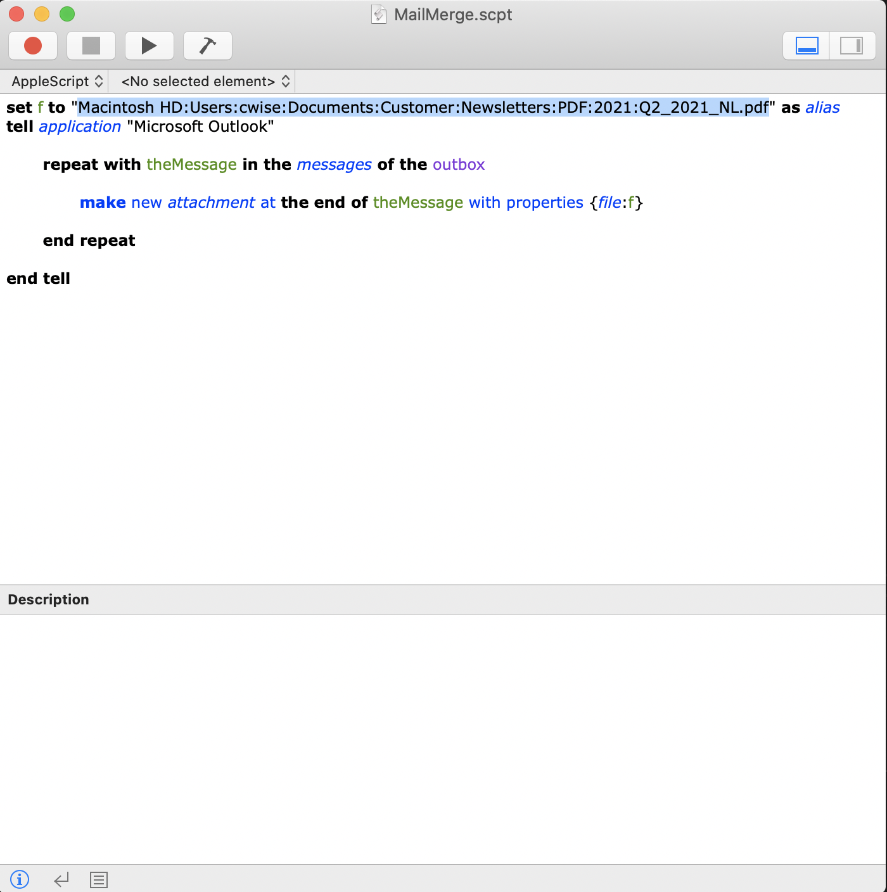

# Territory and Named account contacts
Files are broken in two types:
 - Customers
 - Partners


# Structure

Structure types are:
 - name - customers first and last name
 - email
 - company - customers company name
 - title - persons title
 - data1 - open entry point  
 - data2 - open entry point
 - phone
 - category - customer or partner
 - type - `T` is for `Territory`; `N` is for `Named`

```
[
{
  "name": "John Doe",
  "email": "jdoe@mail.com",
  "company": "Acme",
  "title": "Manager",
  "data1": "",
  "data2": "",
  "phone": "111-222-1234",
  "category": "customer",
  "type": "T"
},
{
  "name": "Joe Public",
  "email": "jpublic@mail.com",
  "company": "WWT",
  "title": "Solutions Architect",
  "data1": "",
  "data2": "",
  "phone": "111-222-1234",
  "category": "partner",
  "type": ""
}
]
```
# USAGE

First Time

Use `git clone git@github.com:cwise24/contactAndmail` this will create a local folder with all the files needed

Start with `git pull` **ALWAYS**
This will update your local files with any changes that may have been made.

# Python

From your terminal, `cd contactAndmail/Py_Scripts` so you are in the directory, from here it's a normal Python script<br>
`./locate.py`

Example:

```
cwise@FLD-ML-00021617 ~/Projects/contactAndmail
 % ./locate.py 
Enter location to search by: 
         1 => LV 
         2 => AZ 
         3 => NM 
1
Enter company name you want to search by: companyA
First Last email@boyd.com  702-123-1234
```
# Py Program functions

- `help.py` - search for contact by first 3 letters of name
- `locate.py` - search for contact by territory and company name
- `make_csv.py` - makes a csv file for mail merge; all account types and categories
- `nam_mk_csv.py` - makes a csv for mail merge; Named accounts only no partners
- `ter_mk_csv.py` - makes a csv for mail merge; Territory accounts only no partners
- `part_mk_csv.py` - makes a csv for mail merge;  Entire territory **only partners**
- `ter_part_mk_csv.py` - makes a csv for mail merge; Entire territory with partners
- `nam_part_mk_csv.py` - makes a csv for mail merge; Entire Named with partners

For any account use the `locate.py` script to search contacts by *company* name.<br>
If you are unsure of company or location use the `help.py` and enter at least the first 3 letters of the name.<br>
There is also `partner.py` to locate all the partners for all locations.

Lastly, the `make_csv.py` will create a csv file from all 3 lists to be used by mail merge.

# .gitignore

Created by [Gitignore.io](https://www.gitignore.io/)

# Mail Merge

*Based on Mac* <br>
**From a Mac I still had to enable Apple Mail and set my mail reader preference to Outlook**<br>
Open a new word doc and Click on Mailings, from drop down on *Start Mail Merge* select *Email Messages*<br>

Now *Select Recipients* and choose *Use an Existing List..*


Add file and select entire workbook<br>
Now you can begin typeing your message, to add an individuals names from the *Insert Merge Field* section and chosing the header filed name


[](https://www.youtube.com/watch?v=yj_s3cdfVDY "YouTube Video")


**What did work for me**

Using the *MailMerge.scpt*, steps to use

- Open a word docment
- Go to Mailings
- Start Mail Merge => Letters
- Select Recipients => Use Existing List
- Select the list you created using the Python Script above
- When prompted, allow permissions and select Entire Workbook

- Type message
- Insert Merge Field => name
- **Move Outlook to OFFLINE**
- Finish & Merge => Merge to Email
- Open Apple Script with editor



- Edit highlighted line for your file to attach; full path
- Click play button
- Once complete, turn outlook to online

# Mac use of Starup File

**This (mail merge tool) did not work for me**

To setup the drop in file for Word I had to perform these steps

Navigate Word and Preferences:


Now select *File Locations*


Highlight Startup and click *Modify*, here you can select or create a new folder to house your startup files


Now close Word; Once you open it again you will now see the Merge Tools